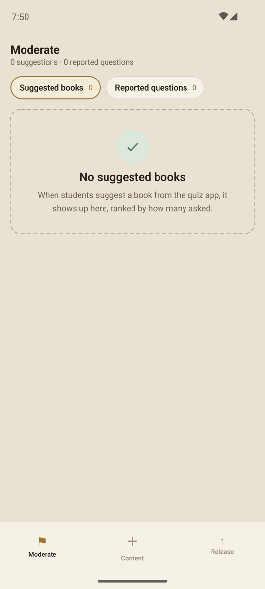
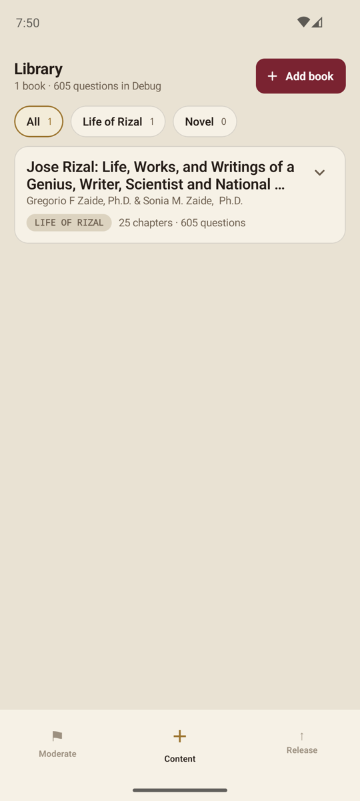
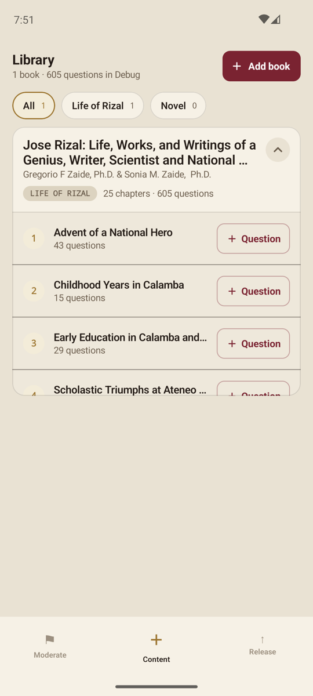
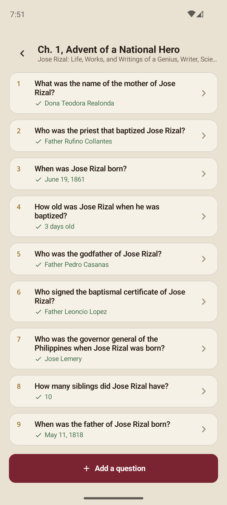
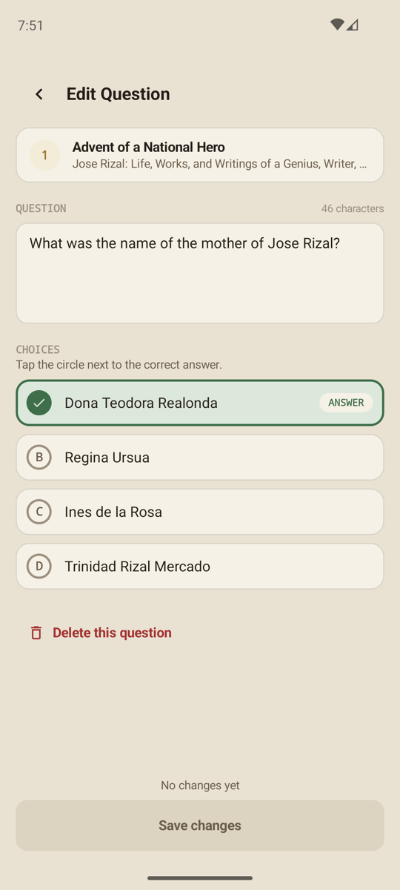
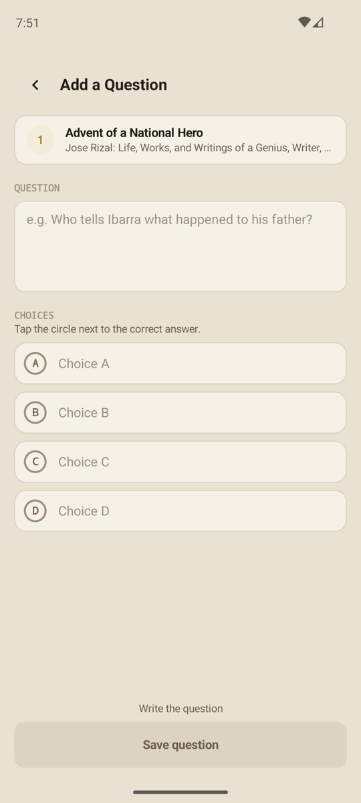
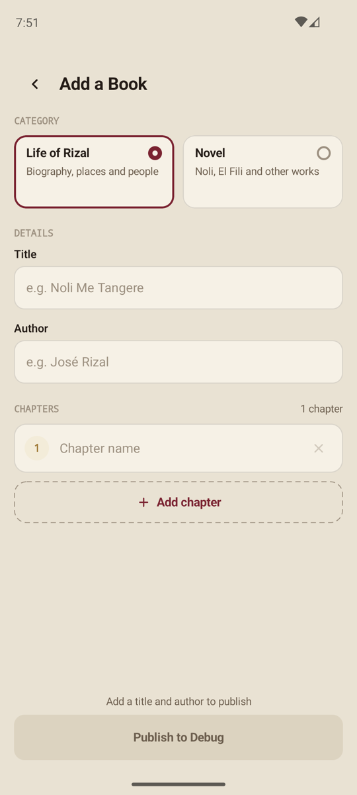
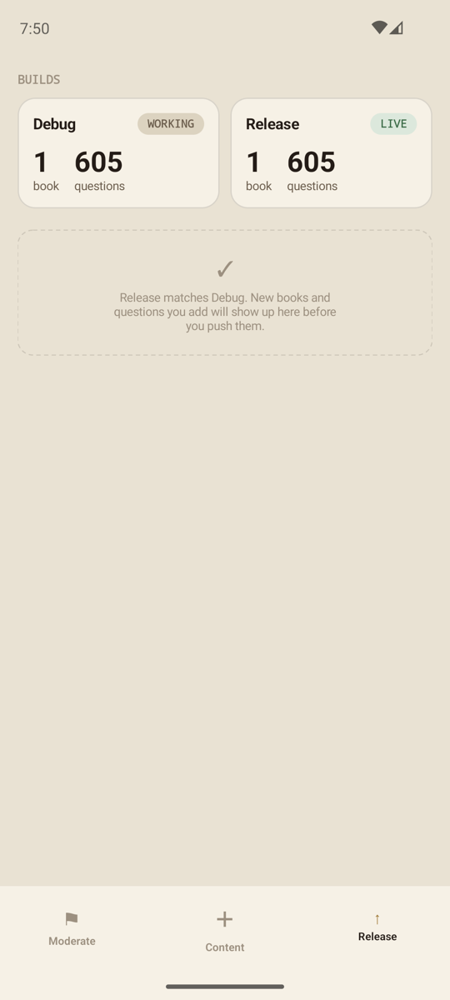

# Ilustrado Admin

The Android admin app for **Ilustrado**, the José Rizal quiz app ([QuizRizal](../QuizRizal)). Admins use it to write quiz content, review what students send in, and publish content to the live app.

## Screenshots

| Moderate | Content | Chapters |
|:---:|:---:|:---:|
|  |  |  |

| Chapter questions | Edit Question | Add a Question |
|:---:|:---:|:---:|
|  |  |  |

| Add a Book | Release |
|:---:|:---:|
|  |  |

## What it does

The app opens on a login screen, then has three tabs.

**Moderate**: student feedback from the quiz app.
- **Suggested books**, ranked by how many students asked. Add a book straight from a suggestion (title and author are filled in), or remove the suggestion. Titles already in the library are marked.
- **Reported questions**, ranked by report count, with the reasons students gave. Fix the question or dismiss the report.
- Removing and dismissing can be undone from the snackbar.

**Content**: the library in Debug.
- Books with chapter and question counts, a category filter, and a warning when a chapter has no questions.
- Open a chapter to see its questions. From there, add a question, or edit or delete an existing one.
- Add a book with its category and chapters.

**Release**: publishing.
- Compares Debug with Release and lists every new, edited and removed book, chapter and question.
- **Revert** a question change to put that question in Debug back to how it is in Release. Release itself isn't touched.
- **Push** copies Debug to Release, including deletions. Students get the changes the next time the quiz app loads content.

## Setup

1. **Firebase project.** Use the same Firebase project as the quiz app. Put its `google-services.json` in `app/`. It's git-ignored.
2. **Sign-in.** In the Firebase console, enable **Authentication › Sign-in method › Email/Password**. Then create the admin user under **Authentication › Users**.
3. **Firestore rules.** The rules live in the QuizRizal repo (`firestore.rules`). Replace `REPLACE_WITH_ADMIN_UID` in `isAdmin()` with the admin user's UID, then publish the rules. Without this, every write from this app is denied.

## Build and run

Open the project in Android Studio and run the `app` configuration, or from the command line:

```sh
./gradlew :app:assembleDebug     # build a debug APK
./gradlew :app:installDebug      # install on a connected device
```

| | |
|---|---|
| minSdk / targetSdk | 26 / 37 |
| Language | Kotlin 2.4, Java 11 bytecode |
| UI | Jetpack Compose, Material 3 |

## Firestore data

Each path below exists twice: `{env}` is `debug` or `release`.

| Path | Contents |
|---|---|
| `quiz/{env}/books/{bookId}` | `id`, `book_name`, `author`, `category`, and `chapters`, which is a JSON string of chapters and their questions |
| `quiz/{env}/feedback/suggested_book` | `feedback`: a JSON array of `{book_title, author, school}` |
| `quiz/{env}/feedback/dispute_answer` | `feedback`: a JSON array of `{quiz_id, question, reported_issue, chapter_number}` |

How the app uses these:
- **Content edits** go to the environment matching the build type. A debug build writes to `debug`.
- **The Release tab** reads both environments and copies `debug` to `release` when you push.
- **Feedback** is read and rewritten inside Firestore transactions, so submissions that arrive while you moderate aren't lost.

## Project structure

```
app/src/main/java/com/thelazybattley/joserizalquizadmin/
├── base/           BaseViewModel, BaseState, BaseActions, BaseCallback
├── data/           Repository implementations, Room database, Firestore DTOs, Hilt modules
├── domain/         Repository interfaces, models, use cases
└── presentation/
    ├── feature/    One package per screen: login, moderate, content, addbook,
    │               addquestion, chapterquestions, editquestion, release
    ├── navigation/ AppNavigation, AppDestinations, bottom bar
    └── ui/         Theme (AppTheme colors and typography) and shared components
```

Each feature follows the same pattern:
- `XState`, the screen's state;
- `XActions`, what the user can do;
- `XCallback`, the action handler the UI calls, with a `default()` for previews;
- `XDestinations`, where the screen can navigate;
- `XViewModel`;
- `ui/XScreen`.

ViewModels run use cases on `Dispatchers.IO` and update state on the main thread.

Books are cached in Room, so the Content tab shows the last loaded library immediately and while offline.

## Known limitations

- **Questions are matched by their exact text.** This applies to reports and to the Release comparison. Rewording a question clears its reports when you save, if you leave that option ticked. On the Release tab it shows as one removed and one new question, so undoing a reword means reverting both.
- **Only question changes can be reverted** on the Release tab, not book or chapter changes.
- **Saving a question rewrites the whole book.** If two admins edit the same book at once, one change can be lost.
- **Deleted books stay on the phone.** A book deleted in the Firebase console stays in the local cache until the app's data is cleared.
- **There's no sign-out.**
- **There are no automated tests yet.**
